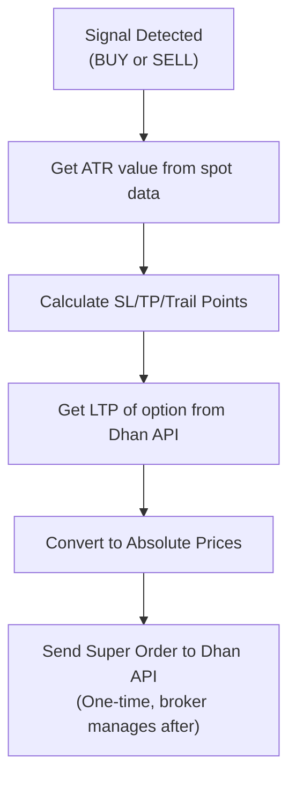
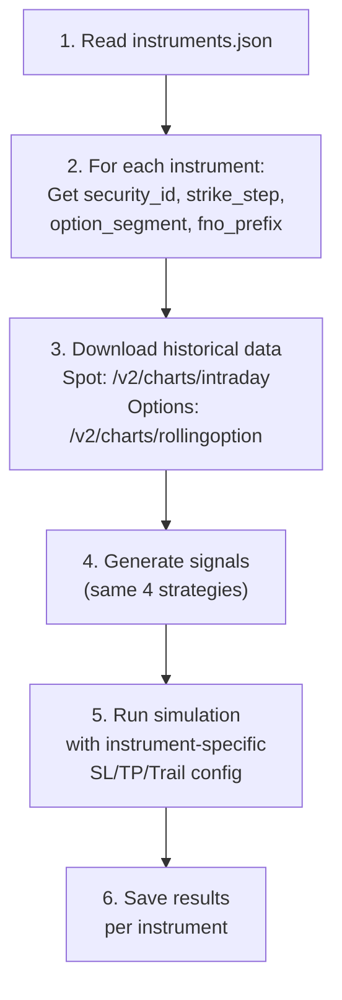

# Backtesting System - Full Analysis & Improvement Plan

## Part 1: How Your Live Bot Actually Works (SL / TP / Trailing)

You are correct. In your live bot, **everything is calculated once and sent to Dhan at order time.** There is NO monitoring loop, no activation point. Dhan's broker system handles SL/TP/Trailing automatically via **Super Order (Bracket Order)**.

### The Live Bot Calculation Flow (lines 2373-2514)



### Exact Calculation (from your code):

```python
# Step 1: Get multipliers (line 2386-2391)
sl_mult  = instruments.json → 'sl_mult_buy' or config.ATR_SL_MULTIPLIER (1.4)
trail_mult = instruments.json → 'trailing_mult_buy' or config.ATR_TRAIL_MULTIPLIER_BUY (1.6)

# Step 2: Calculate points in SPOT terms (line 2394-2396)  
spot_sl    = ATR × sl_mult          # e.g. 50 × 1.4 = 70 Nifty points
spot_tp    = ATR × ATR_TP_MULTIPLIER # e.g. 50 × 12.0 = 600 Nifty points
spot_trail = ATR × trail_mult        # e.g. 50 × 1.6 = 80 Nifty points

# Step 3: Convert to OPTION terms using delta (line 2398-2399)
opt_sl    = spot_sl × delta          # e.g. 70 × 0.5 = 35 option points
opt_trail = spot_trail × delta       # e.g. 80 × 0.5 = 40 option points

# Step 4: Target calculation (line 2421-2445)
# For BUY: Uses fixed profit_target_buy from instruments.json (INR amount / lot_size)
# For SELL: Uses max premium (LTP - 0.05) or fixed profit_target_sell
# Fallback: spot_tp × delta

# Step 5: Send to Dhan as Super Order (line 2510-2514)
place_entry_order(
    sl_points = opt_sl,        # Fixed at order time
    target_points = opt_tp,    # Fixed at order time  
    trailing_jump = opt_trail  # Fixed trailing jump - ALWAYS ACTIVE from entry
)
```

### What Dhan Does After Order Placement:
1. Entry fills at limit price
2. **SL order is placed** at `entry_price - opt_sl` (for BUY)
3. **TP order is placed** at `entry_price + opt_tp`
4. **Trailing:** Every time price moves UP by `opt_trail` points, the SL automatically moves UP by `opt_trail` points
5. No activation trigger needed — trailing starts immediately

> [!IMPORTANT]
> **Your correction is right:** There is no `TRAIL_TRIGGER_ATR` activation in the live bot. The `opt_trail` (trailing jump) is active from the moment the order fills. The trailing moves the SL up by `opt_trail` points every time the price rises by `opt_trail` points.

---

## Part 2: What the Backtest Gets RIGHT vs WRONG

### Currently Correct
| Aspect | Status | Live Bot Reference |
|--------|--------|--------------------|
| Signal generation (all 4 strategies) | Correct | `process_market_data()` line 1225 |
| Strategy parameters (exact values) | Correct | Config lines 82-114 |
| Entry time window (9:20 - 14:59) | Correct | `RUN_START` / `RUN_END` |
| Square-off at 15:00 | Correct | `SQ_OFF_TIME` |
| ATR-based SL calculation | Correct | Line 2394 |
| Option delta conversion | Correct | Line 2398 |

### Currently WRONG (Needs Fixing)
| Aspect | What Backtest Does | What Live Bot Does |
|--------|-------------------|-------------------|
| **Trailing** | Uses `TRAIL_TRIGGER_ATR` as activation + `TRAILING_JUMP` as fixed jump | No activation. `opt_trail = ATR × trail_mult × delta` applied from start |
| **Target (BUY)** | Uses `ATR × ATR_TP_MULTIPLIER × delta` | Uses `profit_target_buy` (fixed INR) from `instruments.json` |
| **Target (SELL)** | Uses `ATR × ATR_TP_MULTIPLIER × delta` | Uses `LTP - 0.05` (max premium decay) or `profit_target_sell` |
| **Per-instrument config** | Single flat config | Each instrument has own `sl_mult_buy`, `sl_mult_sell`, `trailing_mult_buy`, etc. |
| **Entry price** | Uses option open price | Uses LIMIT order at `LTP + 1% buffer` |
| **Option strike** | Rolling ATM from Dhan API | Specific strike chosen via security master + delta from option chain |

---

## Part 3: How to Fix the Simulation Engine

The simulation loop in `optimize_combined.py` needs these changes to match the live bot:

### Fix 1: Trailing Logic (Remove Activation, Match Dhan's Behavior)

```python
# CURRENT (WRONG):
# Trailing only activates after price gains >= TRAIL_TRIGGER_ATR × ATR
# Then SL jumps by fixed TRAILING_JUMP points

# CORRECT (Match Dhan Super Order):
# opt_trail = ATR × ATR_TRAIL_MULTIPLIER × OPTION_DELTA
# Every time High exceeds (Entry + N × opt_trail), SL moves to (Entry + (N-1) × opt_trail)
# Starts from N=1, no activation threshold

# Example: Entry=100, opt_trail=10
# Price hits 110 → SL moves to 100 (breakeven)
# Price hits 120 → SL moves to 110
# Price hits 130 → SL moves to 120
```

### Fix 2: Target Calculation (Per-Instrument from instruments.json)

```python
# For BUY orders:
target_inr = instruments.json → profit_target_buy  # e.g. 1250 INR
lot_size = instruments.json → lot_size             # e.g. 25
opt_tp = target_inr / lot_size                     # e.g. 50 pts

# For SELL orders:
# Use LTP - 0.05 (max premium) or profit_target_sell
```

### Fix 3: Per-Instrument Override Support

```python
# Read from instruments.json for each instrument:
sl_mult_buy = instrument.get('sl_mult_buy', config.ATR_SL_MULTIPLIER)
sl_mult_sell = instrument.get('sl_mult_sell', config.ATR_SL_MULTIPLIER)
trailing_mult_buy = instrument.get('trailing_mult_buy', config.ATR_TRAIL_MULTIPLIER_BUY)
trailing_mult_sell = instrument.get('trailing_mult_sell', config.ATR_TRAIL_MULTIPLIER_SELL)
```

---

## Part 4: How to Backtest ANY Instrument

### Step-by-Step Plan



### What Needs to Change in data_fetcher.py

Currently hardcoded to Nifty (`security_id = "13"`). To support any instrument:

```python
# 1. Read instruments.json
with open("instruments.json") as f:
    instruments = json.load(f)

# 2. For each instrument
for name, config in instruments.items():
    security_id = config['security_id']       # e.g. "13" for Nifty, "25" for BankNifty
    exchange_segment = config.get('exchange_segment', 'IDX_I')  # IDX_I for index, NSE_EQ for stocks
    strike_step = config['strike_step']       # 50 for Nifty, 100 for BankNifty
    option_segment = config['option_segment'] # NSE_FNO, BSE_FNO
    
    # 3. Fetch spot data using the correct endpoint
    # For INDEX: /v2/charts/intraday with exchange_segment
    # For STOCKS: /v2/charts/intraday with NSE_EQ segment
    
    # 4. Fetch ATM options using rollingoption
    # Note: strike_step affects ATM calculation
```

### instruments.json Structure Reference

Your instruments.json likely has entries like:
```json
{
    "NIFTY": {
        "security_id": "13",
        "exchange_segment": "IDX_I",
        "option_segment": "NSE_FNO",
        "strike_step": 50,
        "fno_prefix": "NIFTY",
        "lot_size": 25,
        "num_strikes": 1,
        "expiry_index": 1,
        "sl_mult_buy": 1.4,
        "sl_mult_sell": 1.4,
        "trailing_mult_buy": 1.6,
        "trailing_mult_sell": 1.6,
        "profit_target_buy": 1250,
        "profit_target_sell": 0,
        "daily_limit": 3,
        "max_active": 1
    }
}
```

---

## Part 5: Data Verification Checklist

Before trusting any backtest result, verify these manually:

### Spot Data Verification
- [ ] Pick 5 random dates from `nifty_spot.csv`
- [ ] Open each date on Dhan web chart (1-min, Nifty 50)
- [ ] Compare Open/High/Low/Close of first candle (9:15) and last candle (15:29)
- [ ] Verify total candle count per day = 375 (9:15 to 15:29 inclusive)

### Option Data Verification
- [ ] Pick the same 5 dates from `nifty_atm_ce.csv`
- [ ] On Dhan, find the ATM weekly CE option for that date
- [ ] Compare the opening price at 9:15 — should be within 2-3% of the CSV
- [ ] Note: Exact match unlikely because `rollingoption` uses rolling ATM, not fixed strike

### Signal Verification
- [ ] Run `backtest_engine.py` for a single day
- [ ] Compare the signal output with what `process_market_data()` would have produced on the same candles
- [ ] Verify that entry times are within 9:20-14:59 and exits at 15:00

### PnL Verification
- [ ] Check `live_trades_multi_index.csv` for real past trades
- [ ] Find the same date in backtest results
- [ ] Compare: Did the backtest produce a similar signal direction?
- [ ] Note: Exact PnL won't match because option prices differ

---

## Part 6: Improvement Priority (What to Do Next)

| Priority | Task | Effort | Impact |
|----------|------|--------|--------|
| **P0** | Fix trailing logic to match Dhan Super Order (no activation) | 30 min | High - completely changes results |
| **P0** | Read `instruments.json` for per-instrument SL/TP/Trail overrides | 1 hour | High - matches live behavior |
| **P1** | Per-strategy optimization (one at a time) | 30 min | Medium - cleaner results |
| **P1** | Make `data_fetcher.py` generic (any instrument from instruments.json) | 2 hours | High - enables multi-instrument backtest |
| **P2** | Walk-forward validation (train/test split) | 1 hour | Medium - prevents overfitting |
| **P2** | Match target logic (fixed INR vs ATR-based) | 1 hour | Medium - matches live exactly |
| **P3** | Cross-verify 5 dates against Dhan charts | 30 min manual | Required - trust check |

> [!CAUTION]
> **Do NOT apply any optimized parameters to the live bot until:**
> 1. The trailing logic is fixed to match Dhan's Super Order behavior
> 2. At least 5 historical dates are manually verified against Dhan charts
> 3. Results are re-run with the corrected engine
> 4. A walk-forward test shows profit on unseen data (2025-2026)
