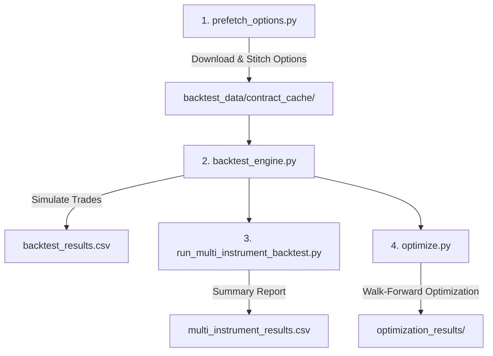
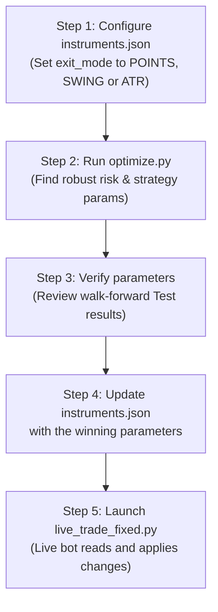

# Backtesting System - Complete Walkthrough

## Architecture Overview

Your backtesting system consists of modular scripts that work together in a pipeline. They allow you to fetch options data, simulate historical trades, analyze multi-instrument performance, and optimize parameters before going live.



---

## The Core Backtesting Scripts

### 1. `prefetch_options.py` — Pre-downloads Option Contracts
**When to run:** Once when testing new dates or after clearing your cache.

**What it does:**
- Scans Spot indices for trade signals using the active strategy rules.
- Connects to Dhan API and downloads option contract candles *only* for dates that generated signals.
- Stitches nearby strikes dynamically using an intrinsic value adjustment algorithm to ensure smooth continuous options pricing.
- Saves data to `backtest_data/contract_cache/`.
- **STOCK Mode Bypass**: Automatically skips downloading options if the target instrument runs in `"STOCK"` mode, saving bandwidth.

**How to run:**
```powershell
..\venv\Scripts\python.exe prefetch_options.py
```

---

### 2. `backtest_engine.py` — Single-Run Simulation
**When to run:** When you want to run a detailed simulation for a single instrument with fixed parameters.

**What it does:**
1. Loads Spot candles from `backtest_data/{symbol}_spot.csv`.
2. Generates strategy signals concurrently using the live bot's `process_market_data` method (running all enabled strategies in `strategies/config.py` and merging their signals).
3. Runs minute-by-minute order simulation:
   - On **BUY signal** → Long trade (buys CE option or buys stock).
   - On **SELL signal** → Short trade (buys PE option or shorts stock).
   - Simulates slippage (0.5% default) and calculates precise NSE brokerage/taxes.
   - Force-closes all intraday trades at 15:00.
4. **Exit Modes**:
   - **`"ATR"` mode (default)**: Exits are executed based on option premium SL/TP/Trailing orders.
   - **`"SWING"` mode**: Exits are executed when the underlying Spot price crosses the recent structural swing low/high buffers.
   - **`"SWING_CONTRACT"` mode**: Exits are executed based on swing highs/lows and ATR calculated and monitored directly on the traded option contract premium/stock price chart itself.
   - **`"POINTS"` mode**: Exits are executed when the contract premium or share price crosses absolute, fixed point thresholds (Stop Loss, Take Profit, Trailing stop) monitored locally.
5. Saves trade logs to `backtest_results.csv` and details to `backtest_results_{symbol}.csv`.

**How to run:**
```powershell
..\venv\Scripts\python.exe backtest_engine.py
```

---

### 3. `run_multi_instrument_backtest.py` — Command-Line Runner
**When to run:** When you want to test multiple symbols, adjust lookback windows, or override settings on the fly.

**What it does:**
- Runs backtests on several instruments sequentially.
- Supports CLI overrides for strategy index, lookback days, and leg modes.
- Saves individual logs to `backtest_results_{symbol}.csv` and performance rankings to `multi_instrument_results.csv`.

**How to run:**
```powershell
# Run Strategy 7 on NIFTY option BUY legs for the last 30 days
..\venv\Scripts\python.exe run_multi_instrument_backtest.py NIFTY -s 7 -l BUY -d 30
```

---

### 4. `optimize.py` — Unified Walk-Forward Parameter Optimizer
**When to run:** To find the most profitable, robust strategy and risk parameters.

**What it does:**
- **Data Partitioning**: Splits historical data into **67% Train** (In-Sample) and **33% Test** (Out-of-Sample).
- **Stage 1 (Coarse Sweep)**: Sweeps strategy parameters and coarse risk parameters on Train data.
- **Stage 2 (Fine Tuning)**: Freezes strategy parameters and sweeps fine risk parameters (SL, TP, Trailing) on Train data.
- **Stage 3 (Walk-Forward Validation)**: Runs a single-pass validation on the Test split using winning Train parameters.
- Prints a **Robustness Verdict** (`[ROBUST]` or `[OVERFITTED]`).

**How to run:**
```powershell
# Optimize Strategy 3 on active enabled instruments over 720 days
..\venv\Scripts\python.exe optimize.py -s Strategy_3 -d 720
```

---

## Exit Mode Comparison: ATR vs. SWING vs. SWING_CONTRACT vs. POINTS

To solve options premium decay and spread sweeps, we added structural swing exits (Spot and Contract levels) as well as absolute points-based exits:

| Feature | Legacy ATR Mode (`"exit_mode": "ATR"`) | Structural SWING Mode (`"exit_mode": "SWING"`) | Premium SWING_CONTRACT Mode (`"exit_mode": "SWING_CONTRACT"`) | Premium POINTS Mode (`"exit_mode": "POINTS"`) |
| :--- | :--- | :--- | :--- | :--- |
| **Exit Trigger** | Evaluated on the option premium price. | Evaluated on the underlying index/stock Spot price. | Evaluated on the option contract / stock premium price itself. | Evaluated on the option contract / stock premium price itself. |
| **Stop Loss (SL)** | Fixed distance below/above entry option premium. | Under/over recent Spot swing low/high + Spot ATR buffer. | Under/over recent Contract swing low/high + Option ATR buffer. | Fixed absolute premium/stock points below/above entry. |
| **Trailing Stop** | Step-based updates on option premium. | Trailed step-based on underlying Spot price. | Trailed step-based on option contract premium. | Trailed step-based on absolute points. |
| **Local Exit Monitoring** | Supported (defaults to `false` for exchange-side bracket orders). | Forced `true` (spot-based structure cannot be processed on Dhan exchange). | Forced `true` (dynamic contract swing wicks require local checks). | Supported (defaults to `true` to avoid Dhan bracket order rejections). |
| **Dhan Broker Implementation** | Linked Bracket Orders (if `local_exit_monitoring: false`) or Standard entry + local monitoring (if `true`). | Standard entries + local Python monitoring loop. | Standard entries + local Python monitoring loop. | Linked Bracket Orders (if `local_exit_monitoring: false`) or Standard entry + local monitoring (if `true`). |
| **Spread Whipsaws** | Vulnerable to wide options bid-ask spreads. | Immune to premium noise; exits only when spot structure breaks. | Semi-immune: uses contract wicks/ATR structure to absorb premium noise. | Fully controlled: exits based on strict point limits. |

### How SWING Mode Exits are Evaluated:
- **Long Spot (BUY CE or Stock Buy)**:
  - $\text{Spot SL Price} = \text{Spot Swing Low (10m)} - (\text{Spot ATR} \times \text{sl\_buffer\_atr\_mult})$
  - $\text{Spot Target Price} = \text{Spot Close} + (\text{Spot ATR} \times \text{tp\_mult\_buy})$
  - Exits if $\text{Spot LTP} \le \text{Spot SL Price}$ or $\text{Spot LTP} \ge \text{Spot Target Price}$.
- **Short Spot (BUY PE or Stock Short)**:
  - $\text{Spot SL Price} = \text{Spot Swing High (10m)} + (\text{Spot ATR} \times \text{sl\_buffer\_atr\_mult})$
  - $\text{Spot Target Price} = \text{Spot Close} - (\text{Spot ATR} \times \text{tp\_mult\_sell})$
  - Exits if $\text{Spot LTP} \ge \text{Spot SL Price}$ or $\text{Spot LTP} \le \text{Spot Target Price}$.

### How SWING_CONTRACT Mode Exits are Evaluated:
- **Long Premium (BUY CE, BUY PE, or Stock Buy)**:
  - $\text{Contract SL Price} = \text{Contract Swing Low (10m)} - (\text{Contract ATR} \times \text{sl\_buffer\_atr\_mult})$
  - $\text{Contract Target Price} = \text{Entry Price} + (\text{Contract ATR} \times \text{tp\_mult\_buy})$
  - Exits if $\text{Contract LTP} \le \text{Contract SL Price}$ or $\text{Contract LTP} \ge \text{Contract Target Price}$.
- **Short Premium (SELL CE, SELL PE, or Stock Short)**:
  - $\text{Contract SL Price} = \text{Contract Swing High (10m)} + (\text{Contract ATR} \times \text{sl\_buffer\_atr\_mult})$
  - $\text{Contract Target Price} = \text{Entry Price} - (\text{Contract ATR} \times \text{tp\_mult\_sell})$
  - Exits if $\text{Contract LTP} \ge \text{Contract SL Price}$ or $\text{Contract LTP} \le \text{Contract Target Price}$.

### How POINTS Mode Exits are Evaluated:
- **Long Premium (BUY CE, BUY PE, or Stock Buy)**:
  - $\text{Contract SL Price} = \text{Entry Price} - \text{points\_sl\_buy}$
  - $\text{Contract Target Price} = \text{Entry Price} + \text{points\_target\_buy}$
  - Trailing updates occur when $\text{Contract LTP} > \text{Entry Price} + \text{points\_trail\_buy}$.
- **Short Premium (SELL CE, SELL PE, or Stock Short)**:
  - $\text{Contract SL Price} = \text{Entry Price} + \text{points\_sl\_sell}$
  - $\text{Contract Target Price} = \text{Entry Price} - \text{points\_target\_sell}$
  - Trailing updates occur when $\text{Contract LTP} < \text{Entry Price} - \text{points\_trail\_sell}$.

---

## 🛠️ Dynamic Parameter Resolution (Strike Steps & Lot Sizes)

To replicate historical exchange trading accurately, the engine dynamically resolves contract parameters:
1.  **Registry Initialization**: The engine lazily loads [strike_step_history.json](file:///c:/Users/sheta/100%20Days%20of%20code/boxdata/Live%20trading/nifty_options_aws_deployment/strike_step_history.json) and [lot_size_history.json](file:///c:/Users/sheta/100%20Days%20of%20code/boxdata/Live%20trading/nifty_options_aws_deployment/lot_size_history.json) (compiled from 200+ F&O bhavcopies).
2.  **Date & Expiry Matching**: On trade entry, the engine maps the current trade date and target contract expiry to retrieve the exact lot size and strike step size that were active on the exchange.
3.  **Automatic Fallback**: If the symbol or date is missing, it falls back to indices overrides or the static values defined in `instruments.json`.

---

## 🛡️ Gate Keeper Option Entry Validation System

The Gate Keeper acts as an option chain filter to confirm momentum and volume buildup before signal execution:
1.  **Open Noise Filter**: Blocks entries within the first `gatekeeper_time_filter_minutes` (e.g., 20) of market open to avoid volatile spread gaps.
2.  **Buildup Verification**: Evaluates ATM, ATM-1, and ATM+1 strikes:
    - **Option Buy (Long)**: Price must increase (`price_change > 0`).
    - **Option Sell (Short)**: Price must decrease (`price_change < 0`).
    - **OI & Volume**: Option Open Interest change percentage must meet `gatekeeper_oi_min_change_pct` and volume must exceed `gatekeeper_volume_multiplier` times the rolling volume SMA.
3.  **Graceful Bypass**: Bypasses missing columns (e.g. OI or Volume if not present in the historical cache) to validate on the remaining available parameters.

---

## Typical Walk-Forward Workflow



---

## 📊 Interpreting Backtest Exits & Gap Tracking

When reviewing the `Exit_Reason` column in `backtest_results_{symbol}.csv`, the engine tracks and classifies how exits occurred:

### 1. Standard Exits (Normal Wicks)
Fires when the price breaks the SL/Target inside a 1-minute candle:
*   **`StopLoss`**: Price crossed SL during the candle.
*   **`Target`**: Price crossed profit target during the candle.
*   **`Time_SquareOff`**: Position closed at 15:00 intraday cut-off.

### 2. Gap Exits (Candle Open Breaches)
Fires when the opening price of a new candle has already gapped beyond the SL/Target level:
*   **`GapDown_SL`** (Long): Opened at/below Stop Loss.
*   **`GapUp_Target`** (Long): Opened at/above Target.
*   **`GapUp_SL`** (Short): Opened at/above Stop Loss.
*   **`GapDown_Target`** (Short): Opened at/below Target.

> [!NOTE]
> For all Gap exits, the simulator fills the exit price at the **opening price** of the candle (plus/minus slippage) rather than the original SL/Target level. This guarantees that slippage is fully accounted for when gaps occur.

---

## 📊 Centralized Market Regime Filtering

You can filter entry signals generated by any strategy based on the current market state (Trend or Volatility) by configuring allowed regimes in [instruments.json](file:///c:/Users/sheta/100%20Days%20of%20code/boxdata/Live%20trading/nifty_options_aws_deployment/instruments.json).

### 1. How Regimes are Classified
*   **Trend Regime (ADX)**:
    *   `"TREND"`: ADX > 25.0
    *   `"RANGE"`: ADX < 20.0
    *   `"NEUTRAL"`: 20.0 <= ADX <= 25.0
*   **Volatility Regime (ATR% / Median ATR%)**:
    *   `"HIGH_VIX"`: ATR% (ATR / Close * 100) > Median ATR% of the evaluated history.
    *   `"LOW_VIX"`: ATR% <= Median ATR% of the evaluated history.

### 2. Configuration Example
To configure an instrument to only take entries during trending markets with low options volatility:
```json
"NIFTY": {
    "allowed_regimes_trend": ["TREND"],
    "allowed_regimes_vol": ["LOW_VIX"]
}
```
If either parameter is omitted from `instruments.json`, no filter of that type is applied, preserving the default strategy signals.


