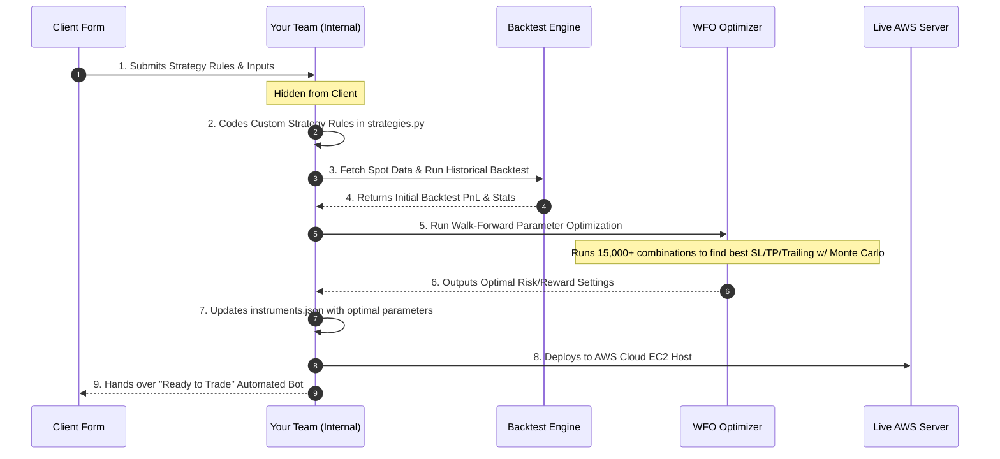

# SATP Client Onboarding & Strategy Intake Form Blueprint

This document defines the two distinct layers of the onboarding process:
1. 🖥️ **Client-Facing Form**: The clean, simplified form your client sees to provide credentials, risk rules, and describe their custom trading strategy logic.
2. ⚙️ **Internal SATP Backend Workflow (Hidden from Customer)**: The technical steps your team executes in the background (coding, backtesting, optimizing, and deploying on AWS) before handing over the finished bot.

---

## 🖥️ Part 1: Client-Facing Strategy Intake Form
*What the customer sees and fills out.*

### Section 1: Client Profile & Account Verification
*Collecting name and broker details.*
* **Client / Company Name**: (Text) Friendly identifier for alerts.
* **Dhan Client ID**: (Text) Broker account ID.
* **Dhan API Access Token**: (Password) DAILY API key to place live trades.

### Section 2: Capital Allocation & Basic Risk Limits
*Basic controls to keep the client safe.*
* **Target Capital Allocation**: (Currency in INR) e.g., ₹2,00,000.
* **Trading Mode**: 
  * `Stock Mode` (Trade shares directly)
  * `Option Mode` (Trade Option call/put contracts)
* **Maximum Open Positions**: (Integer) Limit on simultaneous trades (e.g. max `1` active trade).
* **Max Daily Trades**: (Integer) e.g. limit to `3` entries per day to prevent overtrading.

### Section 3: The Strategy Builder (Concept & Logic Intake)
*Where the customer describes their trading ideas.*
* **Strategy Name**: (Text) e.g. "EMA Crossover Scalper".
* **Timeframe Preference**: (Dropdown) `1-min`, `3-min`, `5-min`, `15-min`.
* **Indicator Catalog**: (Checkboxes - select all indicators the client wants to use)
  * [ ] Exponential Moving Averages (EMA)
  * [ ] SuperTrend
  * [ ] Average Directional Index (ADX)
  * [ ] Relative Strength Index (RSI)
  * [ ] Bollinger Bands
  * [ ] MACD
* **Entry Rules (Explain in Detail)**: (Text Area)
  * *Example Client Input*: "Buy/Enter CE when 8 EMA crosses above 18 EMA, as long as ADX is above 15. Do the opposite for PE."
* **Exit Rules (Explain in Detail)**: (Text Area)
  * *Example Client Input*: "Exit when price touches the SuperTrend line, or if the opposite crossover occurs."
* **Target & Stop Loss Preferences**: (Dropdown)
  * `Fixed Points` (e.g. Target of 30 points, Stop Loss of 15 points)
  * `Volatility Based (ATR)` (Targets and Stops adapt to market volatility automatically)
  * `Structural (Swing High/Low wicks)` (Stops placed outside recent market candles)

---

## ⚙️ Part 2: Internal SATP Backend Workflow
*What your team does in the background (HIDDEN from the customer).*

### 1. Strategy Translation & Coding
* Translate the client's textual rules into structured Python code in [strategies.py](file:///c:/Users/sheta/100%20Days%20of%20code/boxdata/Live%20trading/nifty_options_aws_deployment/strategies.py).
* Register the custom strategy under a unique ID (e.g. `Strategy_5`).

### 2. Historical Data Gathering
* Download 1-minute historical spot data for the client's chosen instruments to the `backtest_data/` directory.

### 3. Backtesting & Multi-Regime Optimization
* Run a multi-year backtest on the custom strategy using [backtest_engine.py](file:///c:/Users/sheta/100%20Days%20of%20code/boxdata/Live%20trading/nifty_options_aws_deployment/backtest_engine.py).
* Run the walk-forward optimizer ([optimize.py](file:///c:/Users/sheta/100%20Days%20of%20code/boxdata/Live%20trading/nifty_options_aws_deployment/optimize.py)) to sweep across targets, stop-losses, and trailing settings to identify:
  * Highest Net PnL.
  * Lowest Drawdown.
  * Best Monte Carlo Robustness score (resilience to trade shuffling).

### 4. Parameter Deployment
* Take the optimal parameters from the optimization runs and write them to the client's [instruments.json](file:///c:/Users/sheta/100%20Days%20of%20code/boxdata/Live%20trading/nifty_options_aws_deployment/instruments.json) config.
* Map their Dhan credentials securely into [accounts.json](file:///c:/Users/sheta/100%20Days%20of%20code/boxdata/Live%20trading/nifty_options_aws_deployment/accounts.json).

### 5. Live Launch on AWS EC2
* Setup the system on the client's EC2 host.
* Configure the automated cron job to refresh their Dhan access tokens daily at **08:00 AM** (`renew_tokens.py`).
* Start the live bot process (`live_trade_fixed.py`).
