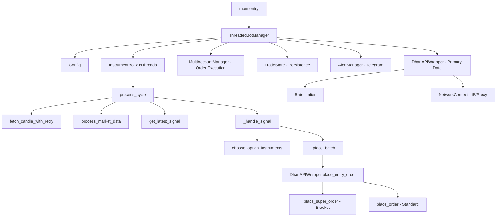

# Live Trade System — Full Architecture Analysis

## 1. Project Overview

`live_trade_fixed.py` is the **production live trading bot** for Nifty/BankNifty/Sensex options on the **Dhan API**. It is a fully multi-threaded, multi-account, multi-instrument execution engine (~3000 lines).

**Supporting file:**
- `hm_selection_optimizer.py` (in parent `Live trading/` folder) — a stock **Hillega Milega** selection backtester using the same `DhanAPIWrapper`.

---

## 2. Architecture — Class & Module Map



---

## 3. Core Classes

### `Config` (Lines 40–241)
Centralized configuration loaded from `.env` and `instruments.json`.

| Key Setting | Value | Notes |
|---|---|---|
| `ENABLE_STRATEGY_3` | `True` | Only active strategy |
| `DATA_INTERVAL` | 1 min | Raw OHLC fetch interval |
| `RUN_START/END` | 09:20 – 14:59 | Trading window |
| `SQ_OFF_TIME` | 15:00 | Auto-stop threads |
| `TM_EMA_LONG/SHORT/BASE` | 50/13/21 | Strategy 3 EMAs |
| `TM_ST_LEN/MUL` | 10 / 2.0 | Supertrend params |
| `TM_ADX_THRESHOLD` | 10 | Low bar for ADX |
| `TM_MAX_STRETCH` | 0.3% | Anti-overextension filter |
| `ATR_SL_MULTIPLIER` | 1.4x | Dynamic SL |
| `ATR_TP_MULTIPLIER` | 12.0x | Wide target |
| `ATR_TRAIL_MUL_BUY/SELL` | 1.6x | Trailing SL |
| `POLL_INTERVAL_SECS` | 30 | Candle polling frequency |
| `PRODUCT_TYPE` | `MARGIN` (from .env = `BOTH`) | |

**Dynamic features:**
- `reload_instruments()` — hot-reload instruments every 5 min
- `reload_api_token()` — auto-heal expired tokens from `.env`
- `get_holiday_set()` — NSE holiday guard with fallback list

---

### `RateLimiter` (Lines 257–341)
Multi-category **Token Bucket** rate limiter:

| Category | Rate |
|---|---|
| QUOTE | 1 req/sec |
| DATA | 5 req/sec |
| ORDER | 10 req/sec |
| NON_TRADING | 20 req/sec |

Has a **Circuit Breaker** — pauses all requests globally for 30s on `429 Too Many Requests`.

---

### `DhanAPIWrapper` (Lines 599–1158)
The core API client. Every API call routes through `_make_request()` which handles:
- Rate limiting (per client-ID)
- Retry with exponential backoff (up to 3 attempts)
- 429 circuit-breaking
- Token expiry auto-recovery (reads `.env` or `accounts.json`)
- Permanent failure categories (no retry for `insufficient funds`, `invalid security`, etc.)

Key methods:
| Method | Purpose |
|---|---|
| `get_historical_data()` | 1-min OHLC via `intraday_minute_data` |
| `get_positions()` | Fetch open positions |
| `place_order()` | Standard LIMIT/MARKET orders |
| `place_super_order()` | Direct REST call to Dhan's Bracket Order endpoint |
| `place_entry_order()` | Dispatcher — routes to Super or Standard order |
| `cancel_order()` | Cancel by order ID |
| `get_pending_orders()` | Fetch PENDING/OPEN orders |
| `close_all_intraday_positions()` | Emergency square-off |

**Network Context (Lines 372–456):**
Thread-local IP binding and proxy injection for multi-account AWS setup:
- `SourceAddressAdapter` — binds to a specific source IP (Private IPs like `10.0.1.33`)
- `NetworkContext` — context manager that patches `requests.Session.request` thread-locally

---

### `MultiAccountManager` (Lines 502–596)
Manages 4 Dhan accounts loaded from `accounts.json`:

| Account | Client ID | Allowed Actions | Instruments | Multiplier |
|---|---|---|---|---|
| Primary_Account | 1102867126 | BUY only | All | 1x |
| Jayesh | 1110617823 | SELL only | NIFTY only | 2x |
| Suresh | 1110511780 | SELL only | NIFTY only | 1x |
| Bhavesh | 1110585727 | SELL only | NIFTY only | 2x |

So the current config effectively:
- **BUYs options** on Primary Account
- **SELLs options** on 3 secondary accounts (heavier sizing)

Each account has a separate `source_ip`, enabling multi-EIP AWS routing.

---

### Signal Pipeline: `process_market_data()` (Lines 1217–1397)
**Strategy 3 — Triple Momentum Breakout** (the only active strategy):

**Step 1: 1-min data → resample to 5-min**

**Step 2: Calculate 5-min indicators:**
- EMA 50 (long trend), EMA 13 (short trend), EMA 21 (base)
- Supertrend(10, 2.0)
- ADX(14)
- Stretch filter: `|close - EMA13| / EMA13 < 0.3%`

**Step 3: Define Long/Short Trend (5-min)**
- **Long:** `close > EMA50` AND `EMA13 > EMA21` AND both slopes rising AND `low > ST_line` AND `ADX > 10` AND `ADX_slope > 0` AND `Stretch < 0.3%`
- **Short:** Mirror inverse conditions

**Step 4: Shift 5-min indicators by 1 period** (anti-lookahead bias)

**Step 5: Map back to 1-min frame via `ffill`**

**Step 6: Generate breakout trigger on 1-min:**
- `TM_Buy = TM_Long_Trend AND close > prev_5m_High`
- `TM_Sell = TM_Short_Trend AND close < prev_5m_Low`

> **Key issue noted:** The signal detection reads `forming_row` (iloc[-1]) for TM signals but `completed_row` (iloc[-2]) for S1/S2. This is an asymmetry — Strategy 3 fires on the forming 1-min candle, which is by design for breakout logic.

---

### `InstrumentBot` (Lines 2063–2524)
One thread per instrument. Independent state:
- `cooldown_until` — 280-second cooldown after each trade
- `daily_trade_counts` — per-account counters, **restored from CSV on restart**
- `consecutive_failures` — triggers alerts at 3 fails, cooldown at 10+

**Trading loop per cycle:**
1. Check market hours
2. Fetch data with `fetch_candle_with_retry()` (smart-wait for latest candle)
3. Process indicators → get signal
4. If new candle + signal → `_handle_signal()`
5. Wait for next minute boundary + jitter offset

**`_handle_signal()` flow:**
1. Early daily-limit check per account (saves API calls)
2. `choose_option_instruments()` → get ATM CE/PE contracts
3. `get_trade_actions()` → map signal + LEG_MODE → actions
4. `_place_batch()` per leg

**`_place_batch()` per item:**
- Fetch LTP via OHLC or fallback to history
- Calculate `opt_sl`, `opt_tp`, `opt_trail` from ATR × delta
- Per-account: check `allowed_actions`, `allowed_instruments`, daily limit, active position count
- Place LIMIT order with 1% buffer above LTP (min 1 pt), snapped to 0.05 tick
- Log to `order_state.json` and `live_trades_multi_index.csv`
- Send Telegram alert

---

### `ThreadedBotManager` (Lines 2806–2980)
Supervisory manager:
- Starts one `InstrumentBot` thread per enabled instrument
- Hot-syncs bots every 5 min when `instruments.json` changes
- **Stale order cleanup** (`_cleanup_stale_orders`): every 10s, cancels PENDING orders older than 3 mins
- Exits cleanly after `SQ_OFF_TIME` when all bot threads die

---

## 4. Option Selection: `choose_option_instruments()` (Lines 1508–1808)

Complex 5-step process:
1. **Get LTP** of underlying via OHLC (fallback: historical data)
2. **Calculate ATM** = round(LTP / strike_step) × strike_step
3. **Get expiry list** from Dhan API (uses `expiry_index` config, default 1 = next expiry)
4. **Fetch Option Chain Greeks** for target strikes → populate delta map
5. **Match contracts** in security master CSV (`dhanhq_cache_{prefix}.csv`) using regex `{prefix}-{MonthYear}-{Strike}-{CE|PE}`

Returns ordered lists `[{id, strike, type, delta, symbol}]` for CE and PE.

---

## 5. `hm_selection_optimizer.py` — Hillega Milega Scanner

Inherits from `DhanAPIWrapper` via `HMScanner`, adds `get_historical_data_chunked()` for multi-week 1-min data.

`HMSelectionOptimizer.calculate_hm_score()` — RSI Oscillator scoring:
- RSI(9) with EMA(3)/WMA(21)/SMA(34) overlays
- Score +20 for RSI > 50, +30 for 50-line crossover, +10 each for structural filters
- Negative mirror for bears

`backtest_selection()` — walks 45 days of daily candles to test top-5 bulls/bears selected each day.

> **Note:** This file is in `C:\Users\sheta\100 Days of code\boxdata\Live trading\` (parent dir), not in the `nifty_options_aws_deployment\` subdirectory.

---

## 6. Bugs & Issues Found

### 🔴 Critical

| # | Issue | Location | Impact |
|---|---|---|---|
| 1 | **Dead code after `return None`** | `_make_request()`, Line 740 | The second `return None` at line 740 is unreachable dead code. No functional impact but indicates copy-paste residue. |
| 2 | **Unreachable `return` in `get_latest_signal()`** | Line 1462 | Second `return None, 0.0, ""` at line 1462 is unreachable (identical to one above). Dead code. |
| 3 | **Legacy `main_loop()` kept in triple-quoted string** | Lines 2528–2803 | Thousands of lines of old loop kept as a `'''...'''` string literal. This consumes memory and is confusing. Should be deleted or moved to a separate file. |

### 🟠 High Priority

| # | Issue | Location | Impact |
|---|---|---|---|
| 4 | **Signal read from `forming_row` not `completed_row`** | `get_latest_signal()` L1413–1419 | S3 TM signals fire on the still-forming 1-min candle. This is intentional for breakout but risks false early triggers before candle closes. |
| 5 | **`hm_selection_optimizer.py` data type bug** | Line 60 | `unit='s' if isinstance(data[0]['timestamp'], ...)` — `data` is a dict (not a list) when API returns `{'open': [], 'close': []}` format. Will crash with `KeyError` or `TypeError`. |
| 6 | **Hard-coded `source_ip` in `accounts.json`** | All accounts | Private IPs (`10.0.1.x`) are AWS-internal. These will fail silently on non-AWS environments. No fallback guard. |
| 7 | **`ATR_TRAIL_MULTIPLIER` referenced in legacy loop** | Line 2673 | Old `main_loop` uses `config.ATR_TRAIL_MULTIPLIER` (singular) which doesn't exist in `Config` — config has separate `_BUY`/`_SELL` attrs. Would error if loop were ever re-enabled. |

### 🟡 Medium Priority

| # | Issue | Location | Impact |
|---|---|---|---|
| 8 | **`get_today_trade_count()` counts unique minutes, not unique trades** | Line 2053 | If 2 trades happen in same minute, they count as 1. Undercounts. |
| 9 | **Jitter-only alignment** | `_initial_alignment()` L2154 | Jitter is 0.5–4.0s. All threads still mostly start at the same minute. Consider larger stagger for many instruments. |
| 10 | **`HMSelectionOptimizer` uses `Config.BASE_DIR`** | Line 91 | `Config.BASE_DIR` points to the `nifty_options_aws_deployment/` subdirectory. The HM file is in the parent. Output CSV will be written to wrong location. |
| 11 | **`_cleanup_stale_orders` checks `Primary_Account` by hardcoded name** | Line 2918 | If account name changes, stale order cleanup breaks for primary account silently. |
| 12 | **`process_market_data()` doesn't check if `pandas_ta` is None** | Lines 1247+ | `ta = None` is set on import failure (L25), but all `ta.ema(...)` calls will throw `AttributeError` without `ta`. |

---

## 7. Data Flow Summary

```
Dhan API (1-min OHLC)
        │
        ▼
fetch_candle_with_retry()   ← smart-wait for fresh candle
        │
        ▼
process_market_data()       ← 1m→5m resample, indicators, TM signal
        │
        ▼
get_latest_signal()         ← read last forming 1-min candle
        │
        ▼
_handle_signal()            ← daily limit + choose options
        │
        ▼
_place_batch()              ← per-account LIMIT order w/ 1% buffer
        │
        ▼
place_entry_order()         ← standard or Super Order (BO)
        │
        ▼
Dhan API (order placement)
+ log_trade_event() → CSV
+ add_order() → order_state.json
+ alert_manager.send_alert() → Telegram
```

---

## 8. Config Files

| File | Purpose |
|---|---|
| `.env` | Primary API token, Client ID, LEG_MODE, Telegram webhook, source IP |
| `accounts.json` | All 4 trading accounts with tokens, IPs, allowed actions/instruments |
| `instruments.json` | Per-instrument config (security ID, lot size, strike step, daily limits, etc.) |
| `order_state.json` | Runtime order tracking (persisted to disk) |
| `live_trades_multi_index.csv` | Trade execution log |
| `holidays_cache.json` | NSE holiday calendar |

---

## 9. Recommendations

1. **Delete dead code** — Remove the `'''...'''` block (legacy `main_loop`) and the duplicate `return None` lines.
2. **Fix `hm_selection_optimizer.py` type bug** — The `data[0]['timestamp']` check needs to handle both dict-of-lists and list-of-dicts API response formats.
3. **Add `pandas_ta` guard** — Wrap all `ta.*` calls with `if ta is None: return df` at the top of `process_market_data`.
4. **Consider closing-candle signal** — Shift TM signal evaluation to `completed_row` (iloc[-2]) to avoid acting on incomplete 1-min candles.
5. **Harden account name lookup** — Don't hardcode `'Primary_Account'` in `_cleanup_stale_orders`; look up by `is_master` flag.
6. **Trade count fix** — Count unique signal events (not unique minutes) in `get_today_trade_count`.
